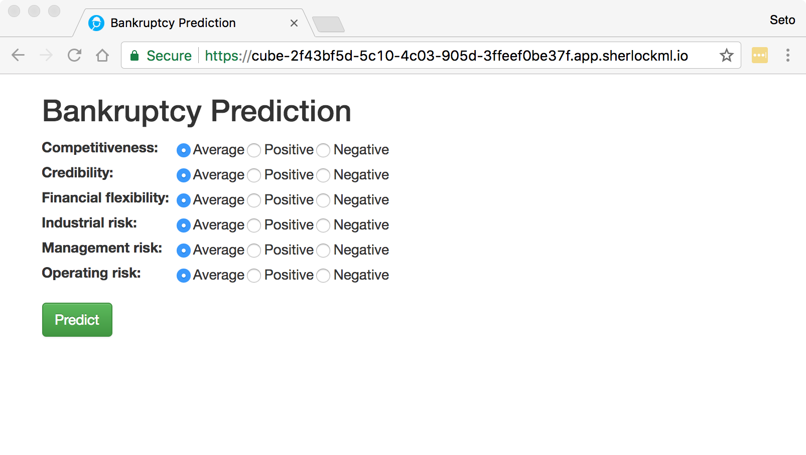

# Consuming data and deploying a model

We will

1. Consume data from an authenticated API. The dataset is for prediciting
whether or not a company will go bankrupt given a bunch of categorical
variables that qualitatively describe certain risk factors associated with
a company.
2. Train a random forest classifier and publish a report of its performance.
3. Deploy the model as a web API.
4. Using our API as a backend, deploy the model as a web app.



The purpose of this exercise is to familiarise yourself with the different
stages of a typical data science project; from getting the data all the way
to productionising your output. You will also be exposed to the more recent and
advanced features of SherlockML.

## Getting started

Clone this repository if you haven't done so already.

If you're coming back to your local repository,
let's make sure it is up to date. Navigate to the repository using "Terminal"
and type `git pull`. For example,

```bash
cd /project/training
git pull
```

This should get the latest source. The current exercise is entirely contained in
`training/Deployment`. From now on, I will start referring to paths relative to
`/project/training/Deployment/`. For example,
`/project/training/Deployment/model/GetData.ipynb` becomes
`model/GetData.ipynb`.

## Installing the module

The python module associated with the exercise has code that is shared by
different stages of the workflow. It is in `module/`.
Navigate to this directory and run

```bash
python setup.py install
```

to install the module.

The source is in `module/bankruptcy/__init__.py`. Take a look at it and
familiarise yourself with what the different functions and classes.

## Getting the data

We have a few handy tools in the module that will enable us to
query the API serving the data. Open the notebook `model/GetData.ipynb`
to start consuming the data.

In order to make an authenticated connection to the API, you will need
the API key. This should be given to you by the instructor. Once you have
the key, create a file called `api_keys.ini` in a folder called `secret/`
with the following contents,

```
[data-api]
key=X
```

and replace `X` with the API key given to you.

You should now be able to connect to the API.

*Exercise*: There is a `# TODO` in `module/bankruptcy/__init__.py` for the
function `ApiSession.get_companies()`. Follow the instructions there. It asks
you to implement pagination in order to obtain all the relevant data from the
API. If this exercise takes you more than 30 minutes, just copy the solution
from `solutions/pagination.py` and move on. If you follow through without
completing this exercise, you will only have data for 40 companies and your
model will be crap!

## Training your model and publishing the results

Now that you have (hopefully all) the data, use `model/TrainModel.ipynb` to
train a random forest classifier. When you're happy with your work, use
the "Publish Report" button to publish a report of your model's performance.

Before we move on, see `model/Predict.ipynb` to make predictions with your
model that should by now be saved to disk.

## Writing and deploying your own API

You've tested your model and now it's time to share it with the world (actually,
with a subset of the world's population who have your special authentication
key).

Use the "APIs" tab on SherlockML to host your Flask API.
The source is in `api/`. You want to set the working directory to point to `api`
(use the full path, e.g. `/project/training/Deployment/api`). The script that
runs the API is `api/run.sh`. You also need to install the dependencies on the
server that will host the API ("Development Server". The dependencies include
our own `bankruptcy` module. Use the "Custom Environments" tab to create a new
custom environment called `model-api`. Paste the contents of
`api/environment.bash` in the "Scripts" section and finally
specify the `model-api` custom environment in the "APIs" interface.

For more information on APIs on SherlockML,
see http://docs.sherlockml.com/user-guide/apis.html .

Finally, use the notebook `api/TestAPI.ipynb` to test your API. Before you can
do this, you have to add a `[model-api]` section to `secret/api_keys.ini`.
Your `secret/api_keys.ini` file should now look like this:

```
[data-api]
key=X
[model-api]
key=Y
```

where `Y` is your model API key. You can see this key by clicking
"Show Key" under the development server in the "APIs" interface.

## Deploying a web app

Now that you've exposed your model via an API, it's time to use it as a backend
for a web app. The source is in `web-app/`. First, modify `web-app/app.py`
so that `URL` points to your model API. This should be the full URL of the
development server with `/predict` added to its end. Again, you can see this
in the "APIs" interface.

Once you've changed `URL`, use the "Apps" tab to create a new web app.
Use `app` for both "Python module" and "Python object" and
make sure that the working directory points to `web-app` (use the full path).
Finally, copy the contents of `web-app/environment.bash` to create 
a new custom environment called `web-app` and point this custom environment
to the web app in the "Apps" interface (just like in the API case above).

For more information on Apps on SherlockML,
see http://docs.sherlockml.com/advanced_usage/using_plotly_dash.html .

That's it! Click on the app to launch it and make some predictions.

## Credits

- Bankruptcy dataset : https://archive.ics.uci.edu/ml/datasets/qualitative_bankruptcy
- Flask Web App tutorial : https://pythonspot.com/en/flask-web-forms/
- CSS files for web app (in `static`) : http://getbootstrap.com/

### Note to instructors

The repository for the API serving the data is
https://bitbucket.org/theasi/bankruptcy-data-api
and the project on which it is hosted is
`Bankrupty Prediction` by `setrak.b`.
